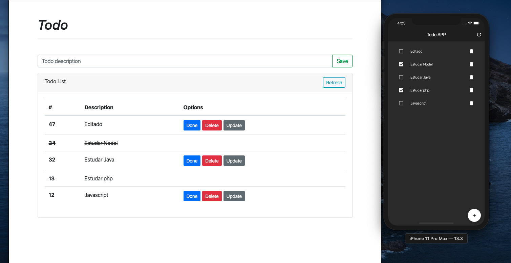

# Example of use of Angular, NestJs and Flutter 
---
#### NestJs - BACKEND
- NestJs (NodeJs)
- TypeOrm
- Mysql2
---
#### Angular - FRONTEND
- Angular 9
- Bootstrap 4
---
#### Flutter - MOBILE
- Mobx
- Http
---

